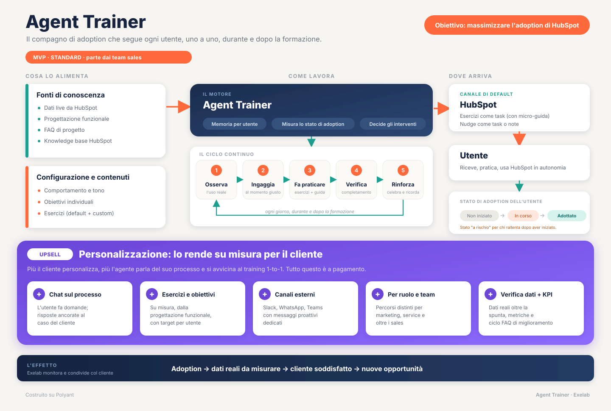

# Agent Trainer

Agente di adoption HubSpot costruito su Polyant, che segue ogni utente del cliente durante e dopo la formazione. Questo repo contiene la progettazione e il contesto, non il codice dell'agente: l'agente si configura nel pannello Polyant.

Lo schema (`docs/funzionale/schema-flusso.svg`) è la sintesi visiva del documento funzionale: fonti → motore → canale HubSpot → utente → stato di adoption, con sotto la fascia upsell. Non va perso né rigenerato a memoria: se cambia il perimetro, si modifica quel file.

## Da dove partire

Leggere nell'ordine:
1. `docs/STATO.md`: a che punto siamo, decisioni prese nelle call, cose da correggere nei documenti.
2. `docs/funzionale/documento-funzionale.md`: cos'è l'agente, MVP contro upsell. È il documento di riferimento.
3. `docs/funzionale/pno-use-case-e-setup.md`: gli use case in scope per l'MVP, nella configurazione per la PoC PNO.
4. `.eve/sources/transcripts/`: le call Fireflies, fonte primaria. Si leggono solo per verificare una decisione, non per intero.

## Struttura

- `docs/funzionale/`: documenti sorgente. Sono versioni di Diego: non si riscrivono, si segnalano le correzioni in `docs/STATO.md`.
- `docs/decisions/`: ADR, una per decisione che cambia il perimetro.
- `.eve/sources/transcripts/`: trascrizioni Fireflies, un file per call, nome `AAAA-MM-GG-titolo.md`, testo verbatim.
- `.claude/methodology.config.md`: `github-flow`. Solo `main`, lavoro su branch `feat/...` o `fix/...` e pull request.

## Perimetro in una riga

MVP standard, proattivo e a senso unico dentro HubSpot, parte dai team sales, esercizi come task, setup in capo a Exelab. Tutto il resto (chat, canali esterni, esercizi custom, obiettivi per utente, altri team, verifica sui dati, KPI) è personalizzazione a pagamento. Vedi capitolo 9 del documento funzionale.

## Regole di questo repo

- Le decisioni di Diego, con data, stanno in `docs/STATO.md`. Se un documento le contraddice, sbaglia il documento: si annota, non si ignora.
- Le trascrizioni Fireflies sono automatiche e piene di errori di riconoscimento ("Polyant" diventa "Poliant/Apolliant/AppSpot"). Non si citano come parole testuali di chi parla senza controllo.
- Un fatto dalla call non diventa decisione finché non è in `docs/STATO.md` con data.
- HubSpot: solo lettura, vale la regola globale di Diego.
